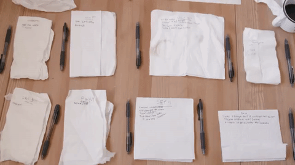
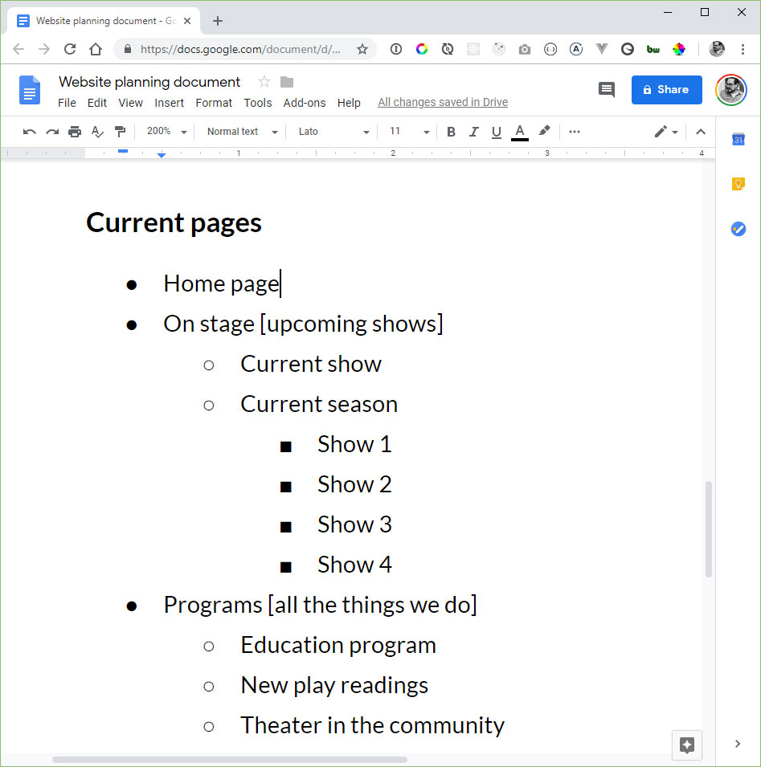
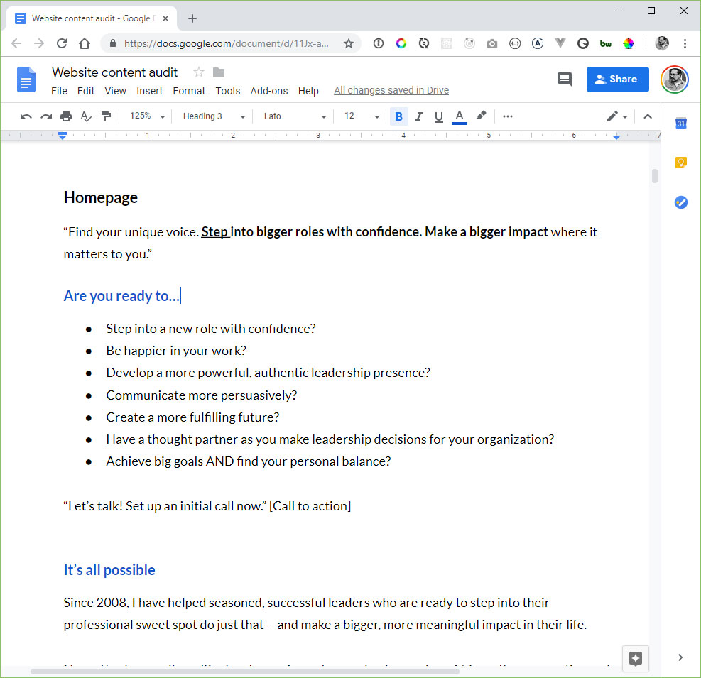

# Where do I start?

Note: I'm guessing everyone here needs a website or website design. This can be a frustrating or confusing moment: where do I start?

There's a temptation to get in the weeds about technologies or designs or integrations with Facebook that you can loose sight of what's important.

---

### Step  1:
# Start with content

Note: My suggestion: start with content. 

---

## Content analysis involves writing out lists.

Note: Is anyone here a list maker? I'm a list addict, perhaps to a fault. 

List are a great way of organizing your thoughts, and clarifying what is important about your website.

---

### List #1: Users and goals

<h2 class="fragment fade-in" style="margin-top: 1em">1. Who is the user?</h2>
<h2 class="fragment fade-in" style="margin-top: .4em">2. What are they trying to accomplish?</h2>

Note: A lot of my initial web designer conversations start with the client saying "Here is a list of websites that I want my website to look like, and it needs to work on phones, and I think we should switch to WordPress."

These are all good questions, and great things to discuss, but I try to slow down the conversation: First...tell me about your business. Tell me about your users. Tell me what your users are using your website to accomplish. 

These questions should be your guiding posts throughout the process. 

---

#### Example list of users and goals
## Community Art Center
 
<ul class="fragment" style="margin-top: 1em">
  <li>**Parents** who are looking for classes that their kids can attend.</li>
  <li>**Art lovers** who are looking to attend art events in their local community.</li>
  <li>**Seniors** who are looking to explore a hobby and find a community of like-minded individuals.</li>
</ul>

Note: *Before revealing personas*...These hypothetical users are often called "personas". Branding agencies can go all out with personas: naming them, coming up with photos, deciding what they ate for breakfast.

---

## List #2: Website pages

<ol>
  <li class="fragment">Write out a list of all pages</li>
  <li class="fragment">If needed, write out a two- or three-word description of that page's content</li>
  <li class="fragment">Don't edit yourself at this point; just write down everything</li>
</ol>

Note: This works whether you are building a new website, or redesigning an old one.

---

#### Example list of website pages

---

## List #3: Content on each page

<ol>
  <li class="fragment">For each page you wrote down in the previous step, start writing out the content</li>
  <li class="fragment">Don't get stuck if you don't have a piece of content. Fill in what you know. For instance, write [TESTIMONIALS GO HERE] if you don't have them yet</li>
</ol>

Note: if you're rebuilding a website, copy and paste the content from the previous website.

---

#### Example document of page content

---

## Next, make a copy of these lists, and start your edits.

<ol>
  <li class="fragment">Is every piece of content on the website helping one of your users accomplish their goal?</li>
  <li class="fragment">Simplify and declutter wherever possible.</li>
  <li class="fragment">Make sure the content on your website is focused.</li>
  <li class="fragment">Have no more than 7 top-level pages. Have no more than 7 sub-pages under each page.</li>
</ol>

Note: This is where Google Docs shines since you can share it, collaborate with others at the same time, make comments, etc., and a revision history is preserved.

Simplify - Do you really need separate About Us, History, Mission, and Vision Statement pages? Could you combine Staff and Board of Directors into "Staff and Board"?

This phase is hugely important, and where you should spend a lot of your time. This document should go through several drafts.

---

## Let's talk about non-written content

<ul>
  <li class="fragment">Logos and other branding material</li>
  <li class="fragment">Photos of your work</li>
  <li class="fragment">Photos of you or your staff</li>
  <li class="fragment">Photos of your building or venues</li>
  <li class="fragment">Other media: videos, audio files, etc.</li>
  <li class="fragment">This list should note which pieces of content you already have, and what content you need.</li>
  <li class="fragment">Put all of this into a Dropbox or Google Drive folder.</li>
<ul>

Note: If you have a collection of podcasts you want to include on your website, it's good to make note of this now. It'll be important to know while picking a platform or speaking with developers.

---

## Detailed content analysis like this will be invaluable as you move into the next phases of your website project. 