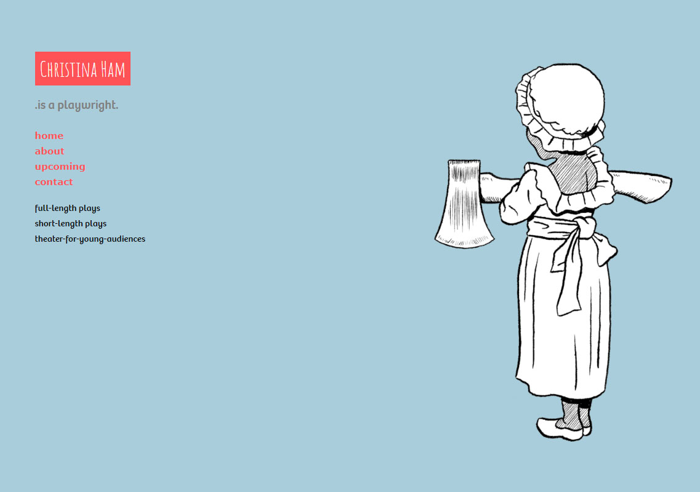

### Part 3:
# Platforms and tools

---

## There are huge number of amazing tools to help you build your website.

Note: This is great news because it means you have so many options to choose from. It's also bad news because if can feel like you're drinking from a firehose. 

---

## Types of content management systems

There is an overwhelming number of content management systems available.

But there are two main kinds: **Website builder services** and **self-hosted CMS's**.

---

## Website builder CMS's

*Examples: SquareSpace, Wix, Weebly, Duda, WordPress.com.*

  <h5>Advantages</h5>
  <ul>
    <li>Great looking templates</li>
    <li>Low cost ($12-$15/month for basic sites, $30-$35/month for e-commerce)</li>
    <li>Ongoing maintenance and support is included</li>
  </ul>

  <h5>Disadvantages</h5>
  <ul>
    <li>Not as customizable as a self-hosted CMS</li>
  </ul>

---

## Self-hosted CMS's

*Examples: WordPress.org, Drupal, Joomla*

  <h5>Advantages</h5>
  <ul>
    <li>Great looking templates (though some may cost extra)</li>
    <li>Fully customizable, and plugins can provide a huge array of additional functionality</li>
  </ul>

  <h5>Disadvantages</h5>
  <ul>
    <li>Higher cost ($1,500 - $4,000 for design/development, ~$100/month for hosting and support)</li>
    <li>Since it is self-hosted, performance, security, and maintenance is all up to you</li>
  </ul>

Note: *Transition to next slide:* Wait, why is WordPress on both lists?

---

## WordPress makes things complicated

- It's the CMS used on 1/3 of all websites.
- It has a site-builder version available at WordPress.com, similar to SquareSpace or Wix.
- It has a self-hosted version available at WordPress.org, which is fully customizable.

---

## Which kind of CMS do I need?

**Site builder CMS's** are great for individuals or organizations who need a simple website with basic functionality&mdash;up to and including an online store.

**Self-hosted CMS's** are best for folks who need more customizability or functionality (e.g.: a complicated event calendar system, advanced integration with a donor database, etc.).

Note: This is where your content and functionality documents will come in really handy.

---

## All CMS's come with pre-made templates or themes.

Note: One of the biggest advantages of a CMS is that a ton of work is already done for you. You don't have to start from scratch.

---

## Use your content and functionality lists to help you pick a template.

Judge a theme by its content and functionality. Be careful not to fall in love with beautiful images and artwork that you can't replicate.

Note: This is why we started with content. 

---

SquareSpace templates are beautiful.

------

...if you have beautiful, high-resolution photos.

---

## Good imagery is important

  
Playwright Christina Ham commissioned illustrator Jacob Stoltz to create images for her SquareSpace site.

  

---

## Sources for free, high-quality images

- [Unsplash](https://unsplash.com/): Beautiful royalty-free photographs
- [Free Nature Stock](https://freenaturestock.com/): Nature photos, royalty-free
- [BarnImages](https://barnimages.com/): Free photos, as well as a blog with design tips
- [Pattern Library](http://thepatternlibrary.com/): Textures and patterns to use on your site.

*When using images, make sure they are royalty-free. These sites say attribution isn't required, but it is appreciated.*

---

## Design tips

<ul>
  <li class="fragment">Simplify whenever, wherever possible</li>
  <li class="fragment">Using templates and plugin as intended will help you in the long run</li>
  <li class="fragment">Carousels are problematic</li>
  <li class="fragment">Be very...purposeful when integrating social media</li>
  <li class="fragment">Test your site, especially on different devices and in different browsers</li>
</ul>
  
Note: Simplify: just because a certain template offers functionality, that doesn't mean you have to use it.

Templates: Avoid hacks and workarounds. Take the time to learn how a certain software was intended to be used. Google things. If it feels like you're breaking the rules, you probably are.

---

## Working with contractors

<ul>
  <li class="fragment">Agencies vs. independent contractors</li>
  <li class="fragment">Is the communication style a fit? Design approach?</li>
  <li class="fragment">Be very clear about cost and project scope</li>
  <li class="fragment">Don't ask for spec work</li>
  <li class="fragment">Communication is hugely important; take great care about how and when you communicate with your contractors</li>
  <li class="fragment">How is the website maintained long term?</li>
</ul>

Note: 
- Agencies are more expensive. Independent contractors are more risky.
- Sign a contract, or at least a project scope document.
- Spec work: you don't ask a plumber to fix your leaky kitchen sink before hiring them to renovate the master bathroom.
- Communication: Assign a single point of contact from your organization. Consolidate notes into a single email. Use a project manager if possible.

---

## Empower staff to become experts.

<ul>
  <li class="fragment">Give them the time and resources to gain expertise</li>
  <li class="fragment">Find workshops (like this one) or conferences for them to attend</li>
  <li class="fragment">Lynda.com is free with a Hennepin Co. library card; SkillShare and Udemy aren't terribly expensive</li>
  <li class="fragment">Have staff report back to the full team on their learnings</li>
</ul>

Note: I've walked into organizations to start talking about a website redesign, and the staff who use the website look terrified. 

I've also walked into organizations where the staff are clearly experts in the website. They know the pain points, they know what needs to happen.

Can you give staff 4 hours a week to learn something new? That's a huge benefit. 